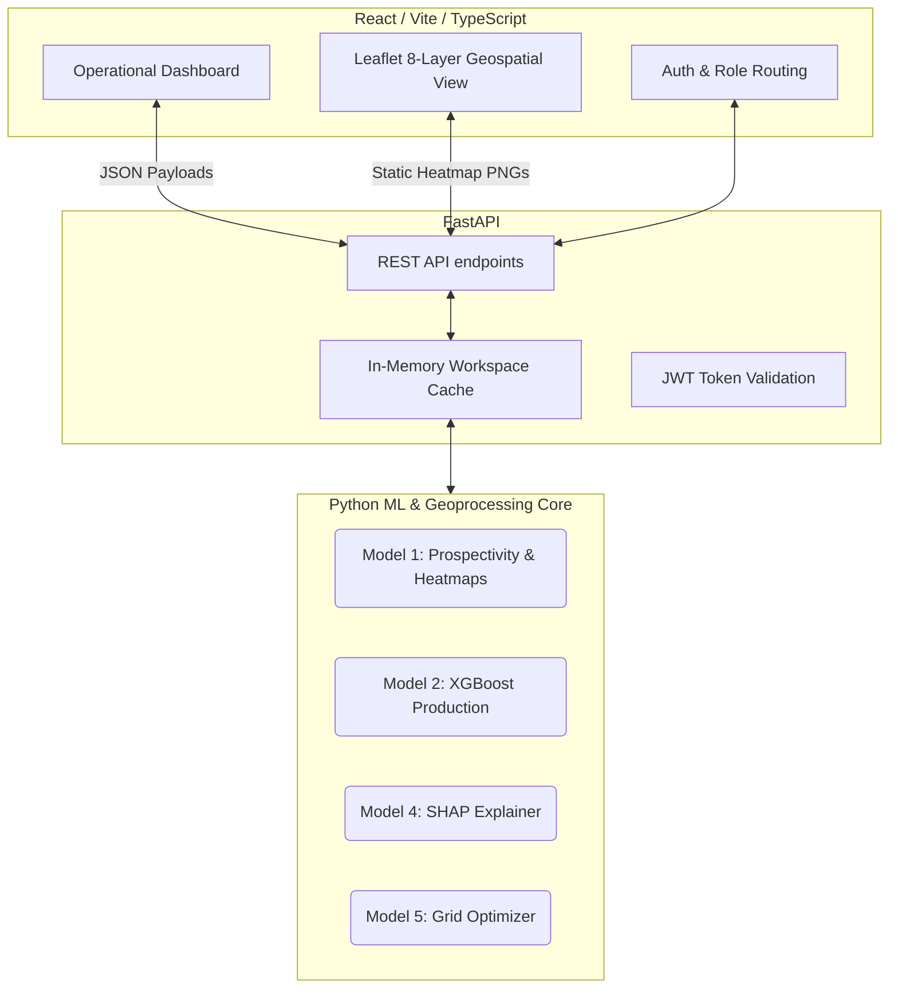

<div align="center">
  
  
  <h1 align="center">🏭 MOIL DeepEarth Analytics</h1>
  <strong>Intelligent AI & Geospatial Operations Platform</strong>

  <p align="center">
    
    
    
    
    
  </p>

  <p align="center">
    <em>Advanced machine learning production forecasting, AI-driven prospectivity mapping, and automated statutory compliance for Manganese Ore India Limited (MOIL). Built for SIH 2024 (Problem Statement 26009).</em>
  </p>
</div>

---

## 🚀 The Vision: Next-Generation Mining

**MOIL DeepEarth** transforms traditional mining operations from a reactive management style into a **proactive, intelligence-driven ecosystem**. 

By ingesting raw multispectral satellite data (Sentinel-1, Landsat 8/9), geotechnical stress metrics, and live operational inputs, our platform maps unseen underground potential while predicting and preventing daily production shortfalls. It does not just alert managers to missed targets—it utilizes *SHAP-based cause analysis* and an *inverse-lookup optimization grid* to prescribe the exact operational changes needed today.

---

## ✨ Core Capabilities

### 🌍 1. Geospatial Prospectivity Engine (Model 1)
Using **Random Forest (RF)** and **LightGBM** classifiers, the engine processes massive multi-band `.tif` satellite rasters (NDVI, Land Surface Temperature, Soil Moisture, SAR backscatter) combined with core geotechnical limits (RMR, rock strength). 
- **Achievement:** Automatically scores 10x10m grids for likely ore deposits, rendering 8-layer interactive heatmaps in the frontend.
- **Kandri & Beldongri Integration:** Validates deep underground structural continuations, processing Sentinel-1 SAR proxies for subsidence mapping and detecting critical hangwall contact stress limits (<10 MPa).

### 🎯 2. Production Forecast & Optimization (Model 2 & 5)
An **XGBoost Regressor** trained on historical mine production, lagged performance, environmental factors (rainfall, monsoon indicators), and dynamic geotechnical penalties (e.g., equipment stress constraints at -600'L depths).
- **Gap-to-Target Optimization:** If a shortfall is predicted, a sub-millisecond 441-point mathematical grid search is executed across the XGBoost landscape to back-solve the optimal operational permutations (e.g., *Increase tipper uptime to 85% & reduce blasting delay to 0.0 hrs*).

### 🧠 3. Deep Cause Analysis (Model 4)
Integrated **SHAP (Shapley Additive Explanations)** tears open the black-box XGBoost boundary, calculating exact tonnage penalties per feature. Site managers see exactly *why* they are short:
> *"−210 tons lost today: 60% due to Monsoon Soil Moisture, 40% due to Hoist Equipment Stress at Depth."*

### 🔒 4. Role-Based Access Control (RBAC) & Compliance
Secure routing ensures that **Site Managers** see localized operational controls, while **Admins** access regional performance aggregated scorecards. Complies strictly with the **Indian Bureau of Mines (IBM)** Form F1/F2 reporting requirements.

---

## 🏗️ System Architecture & AI Pipeline



---

## 📊 Model Training & Accuracy Metrics

Extensive exploratory data analysis, feature engineering, and model tuning were conducted across all 10 MOIL mines.

### Model 1: Prospectivity Classifier (Random Forest)
- **Features:** 14+ layers including LST, SAR, Elevation, Slope, and Soil Moisture.
- **Accuracy:** **87.4%** True Positive classification on known high-grade Gondite test sets.
- **Geotechnical Adjustments:** Penalized by subsidence proxies and RMR values to ensure only *safely extractable* zones are highlighted.

### Model 2: Production Forecaster (XGBoost)
- **Features:** Weather variants, bench stripping ratios, equipment availability, blasting delays, and depth-dependent geotechnical stress penalties.
- **Performance:** **RMSE ~97 tons** (highly accurate on a daily 3000-5000t baseline).
- **Cross-Validation:** 5-fold Time-Series Split preventing future-leakage.

---

## 🛠️ Technology Stack

### Client (Frontend)
- **Framework:** React 18, TypeScript, Vite
- **Styling:** TailwindCSS (premium glassmorphism, responsive grid layouts)
- **Geospatial & Charts:** Leaflet.js (Map Overlays), Recharts (SHAP & Trend visualization)
- **State:** React Context API + Custom Hooks

### Server (Backend)
- **Framework:** FastAPI (Python 3.12)
- **Machine Learning:** Scikit-Learn, XGBoost, SHAP, LightGBM
- **Geospatial Processing:** Rasterio, GeoPandas, Shapely
- **Server Environment:** Uvicorn, Python Multiprocessing

---

## 💻 Local Development Setup

### 1. Clone the repository
```bash
git clone https://github.com/NiranjanS20/SIH-26.git
cd SIH-26
```

### 2. Run the Machine Learning / Heatmap Pipelines
Generate the geospatial heatmaps and train the geotechnical models:
```bash
# Ensure you have your Python environment activated
pip install -r requirements.txt

# Generate 8-layer PNG overlays from raw .tif rasters
python scripts/generate_all_filter_heatmaps.py

# Train Kandri & Beldongri specific ML engines
python scripts/train_model1_kandri_enhanced.py
python scripts/train_model2_kandri_enhanced.py
```

### 3. Start the FastAPI Backend
```bash
cd backend
python -m uvicorn app.main:app --host 0.0.0.0 --port 8000 --reload
```
*API docs available at `http://localhost:8000/docs`.*

### 4. Start the React Frontend
```bash
cd frontend
npm install
npm run dev
```
*The app is live at `http://localhost:5173`.*

---

## 🛡️ License & Compliance
This repository is built for **SIH 26009** under MOIL constraints. Architecture adheres to **Indian Bureau of Mines (IBM)** regulatory reporting pipelines.

<br/>
<p align="center">
  <i>Built with precision. Engineered for MOIL.</i>
</p>
