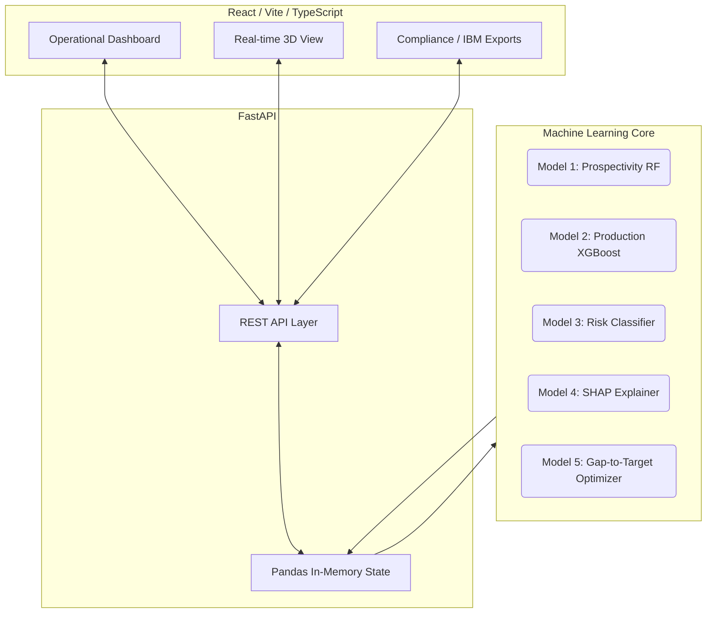

<div align="center">
  
  
  # 🏭 MOIL 
  **Intelligent Operations & Compliance Platform**

  <p align="center">
    
    
    
    
  </p>

  <p align="center">
    <em>Predictive production forecasting, automated gap-to-target optimization, and seamless statutory compliance for Manganese Ore India Limited (MOIL). Built for SIH 26009.</em>
  </p>
</div>

---

## 🚀 The Vision: A-Z Explanation

**MOIL** isn't just a dashboard; it's a **proactive intelligence layer** for mining operations. 

In traditional operations, site managers react to production shortfalls *after* they happen. Compliance reports (like the Indian Bureau of Mines returns) are compiled manually, and geological data is siloed. 

Our platform changes that by integrating **live operational metrics, predictive machine learning, and automated compliance tracking** into one unified, stunning interface. It doesn't just tell you that you will miss your target—it tells you *why*, and exactly *what buttons to push* today to fix it.

---

## ✨ Core Capabilities

### 🎯 1. Predictive Production & Gap-to-Target Engine
At the heart of the platform is an XGBoost forecasting engine that predicts daily production shortfalls. If a high risk is detected, the **Gap-to-Target Inverse Lookup Engine** simulates hundreds of operational permutations (e.g., uptime, blasting delays) and returns the top 3 least-effort, mathematically viable actions to hit the target.

### 🧠 2. Deep Cause Analysis (SHAP)
No black boxes. When the AI predicts a drop in production, the integrated SHAP (Shapley Additive Explanations) explainer breaks down the exact tonnage lost due to specific constraints—whether it's `equipment downtime`, `blasting delays`, or a `severe monsoon`. 

### 📜 3. Automated Statutory Compliance (IBM)
Built natively to comply with DGMS and **Indian Bureau of Mines (IBM) Regulatory Standards**. The platform acts as a centralized operational documentation engine, compiling production records, environmental clearances, and safety logs into publication-ready executive scorecards and **Automated Form F1/F2** statutory packets.

### 🌍 4. Prospectivity & Geological Mapping
Machine learning classifiers (Random Forest/LightGBM) trained on geological features to predict and rank new prospective ore deposits, turning raw survey data into actionable drilling targets.

---

## 🏗️ Architecture & AI Pipeline



### The AI Models (Deep Dive)
1. **Model 1 (Prospectivity):** Classifies and scores land grids for likely ore deposits using geological and spatial markers.
2. **Model 2 (Production Forecaster):** A leak-free XGBoost model trained on historical production, lagged performance, and IBM-calibrated seasonal weather constraints (RMSE ~97t).
3. **Model 3 (Shortfall Logic):** Deterministic engine routing days into Low, Medium, and High-Risk categories.
4. **Model 4 (SHAP Cause Analysis):** Deconstructs the XGBoost boundary to assign exact tonnage penalties to operational blockers.
5. **Model 5 (Corrective Action Grid):** Runs a sub-millisecond 441-point grid search over the XGBoost model to back-solve the optimal adjustments (e.g., *Increase uptime to 75.5% and reduce blasting delay to 0.0 hrs*).

---

## 🛠️ Tech Stack

### Client (Frontend)
- **Framework:** React 18 + TypeScript + Vite
- **Styling:** TailwindCSS (with glassmorphism & modern premium aesthetics)
- **Visuals:** Recharts for data visualization, Three.js for 3D interactions.

### Server (Backend)
- **Framework:** FastAPI (Python 3.12)
- **Data Processing:** Pandas, NumPy
- **Machine Learning:** XGBoost, Scikit-Learn, SHAP, CatBoost
- **Server:** Uvicorn

---

## 💻 Getting Started (Local Development)

### 1. Clone the repository
```bash
git clone https://github.com/your-repo/moil-sih-26009.git
cd moil-sih-26009
```

### 2. Start the FastAPI Backend
```bash
# Navigate to the backend or project root (where requirements are)
python -m venv venv
source venv/Scripts/activate  # (On Windows)
pip install -r requirements.txt

# Run the server
uvicorn backend.app.main:app --reload --port 8000
```
*The API docs will be available at `http://localhost:8000/docs`.*

### 3. Start the React Frontend
```bash
# In a new terminal
cd frontend
npm install
npm run dev
```
*The app will be available at `http://localhost:5173`.*

---

## 🛡️ License & Compliance
This project was developed for **SIH 26009**. It is designed around the reporting protocols of the **Indian Bureau of Mines (IBM)** and internal MOIL constraints. 

<br/>
<p align="center">
  <i>Built with precision. Engineered for MOIL.</i>
</p>
