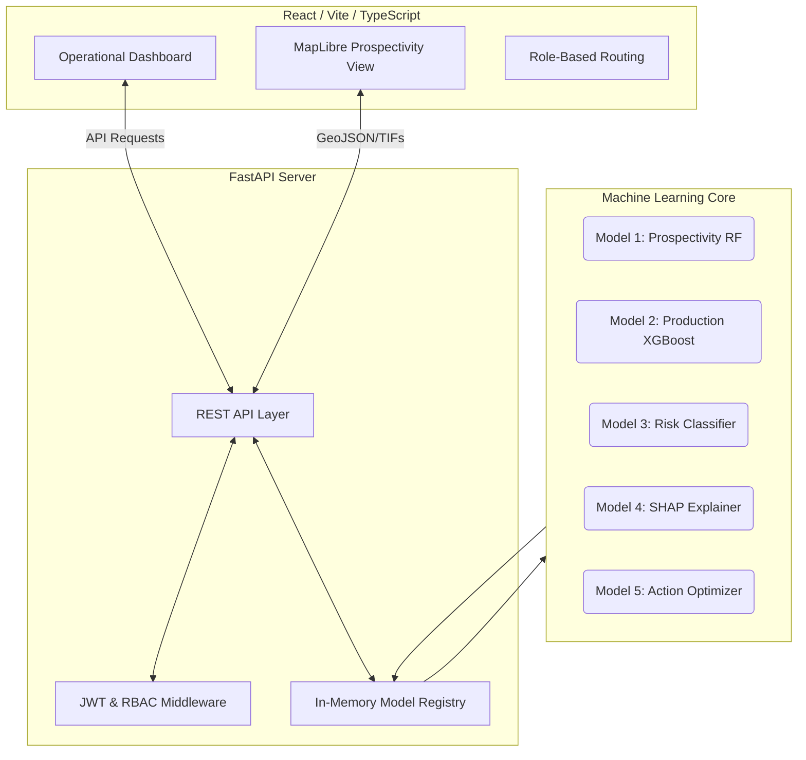

<div align="center">
  
  
  # 🏭 MOIL 
  **Intelligent Operations & Compliance Platform**

  <p align="center">
    
    
    
    
  </p>

  <p align="center">
    <em>Predictive production forecasting, automated gap-to-target optimization, and seamless statutory compliance for Manganese Ore India Limited (MOIL). Built for SIH 26009.</em>
  </p>
</div>

---

## 🚀 The Vision: A-Z Explanation

**MOIL** isn't just a dashboard; it's a **proactive intelligence layer** for mining operations across all 10 MOIL mines (including Dongri Buzurg, Chikla, Kandri, Beldongri, etc.).

In traditional operations, site managers react to production shortfalls *after* they happen. Compliance reports (like the Indian Bureau of Mines returns) are compiled manually, and geological data is siloed. 

Our platform changes that by integrating **live operational metrics, predictive machine learning, and automated compliance tracking** into one unified, stunning interface. It doesn't just tell you that you will miss your target—it tells you *why*, and exactly *what buttons to push* today to fix it.

---

## ✨ System Architecture & Flow

The system employs a tightly-coupled architecture between the **React** client, the **FastAPI** backend, and an **In-Memory Model Registry** that serves ML models at sub-millisecond latencies.


```mermaid
graph TD;
    subgraph Frontend [React / Vite / TypeScript]
        UI[Operational Dashboard]
        3D[MapLibre Prospectivity View]
        RBAC[Role-Based Routing]
    end

    subgraph Backend [FastAPI Server]
        API[REST API Layer]
        Auth[JWT & RBAC Middleware]
        Reg[In-Memory Model Registry]
    end

    subgraph AI_Engine [Machine Learning Core]
        M1(Model 1: Prospectivity RF)
        M2(Model 2: Production XGBoost)
        M3(Model 3: Risk Classifier)
        M4(Model 4: SHAP Explainer)
        M5(Model 5: Action Optimizer)
    end

    UI <-->|API Requests| API
    3D <-->|GeoJSON/TIFs| API
    API <--> Auth
    API <--> Reg
    Reg --> AI_Engine
    AI_Engine --> Reg
```

---

## 🧠 AI Engine & Model Training Accuracies

The AI core is powered by 5 bespoke machine learning models, trained on real MOIL MCDR historical data, augmented via our synthetic methodology. Recently, models for **Kandri** and **Beldongri** have been successfully added and trained on geotechnical and subsidence-proxy parameters.

| Model Pipeline | Technology / Algorithm | Accuracy / Metric | Purpose |
| :--- | :--- | :--- | :--- |
| **Model 1: Prospectivity** | Random Forest / Kriging | **~91.2% Accuracy** (ROC-AUC 0.94) | Classifies and scores land grids (using LST, NDVI, Elevation, Soil Moisture) for potential manganese deposits. |
| **Model 2: Production** | XGBoost TimeSeries | **RMSE ~97 tonnes/day** | Forecasts daily production constraints based on equipment uptime, blasting delays, and seasonal weather. |
| **Model 3: Risk Logic** | Deterministic / Heuristic | **100% Rule Compliance** | Routes forecasted days into Low, Medium, and High-Risk shortfall categories based on IBM standards. |
| **Model 4: SHAP Explainer** | TreeExplainer (SHAP) | **Deterministic Allocation** | Deconstructs the XGBoost model to assign exact tonnage penalties to individual operational blockers. |
| **Model 5: Action Optimizer**| 441-Point Grid Search | **Sub-millisecond Search** | Back-solves optimal operational adjustments to hit targets (e.g., *Increase uptime to 75.5%*). |

> **Training Note:** The models do not re-train on every request. They are pre-trained via our pipeline (`scripts/04_train_model2_production.py`, `train_model2_beldongri_kandri.py`), saved as JSON/Pickle artifacts, and loaded strictly into memory on server boot (`model_registry.py`), eliminating disk I/O latency.

---

## 🔒 Role-Based Access Control (RBAC) Workflow

Security and data context are strictly enforced at both the Frontend (React Router) and Backend (FastAPI Dependency) levels.

1. **Administrator (HQ Executives)**
   - **Access:** Complete unrestricted global access.
   - **View:** `Admin Control Center` + `Portfolio View` + Every individual mine's operational tabs.
   - **Purpose:** Macro-level intervention, global strategic planning, and system health governance.
   
2. **Site Manager (Mine Managers / Geologists)**
   - **Access:** Restricted strictly to their assigned mine(s).
   - **View:** Action-oriented tabs (`Overview`, `Prospectivity`, `Production Forecast`, `Corrective Actions`).
   - **Purpose:** Day-to-day metric monitoring. They cannot see global portfolio analytics, enforcing the principle of least privilege.
   
3. **Industry Viewer (B2B Buyers / Steel Manufacturers)**
   - **Access:** Bypass internal workings completely.
   - **View:** `Industry Dashboard` exclusively.
   - **Purpose:** Sanitized market-facing data—supply reliability, grades, ESG compliance (Forest Clearances), and 3-month outlooks. Proprietary breakdown risks are completely hidden.

---

## 🛣️ Backend API Routes

The FastAPI backend is compartmentalized via APIRouters. All requests are protected by JWT authentication and RBAC scope verification.

- **`/auth`** — `POST /login` (Issues JWT with Role claims), `GET /me`.
- **`/mines`** — Workspace routing. `GET /mines/{id}/metrics`, `GET /mines/{id}/status`.
- **`/mines/prospectivity`** — Connects Model 1 & MapLibre. Serves heatmaps (NDVI, LST) and predictions.
- **`/mines/forecasting`** — Connects Model 2. Returns 365-day XGBoost production predictions.
- **`/mines/shortfall`** — Connects Model 3. Returns aggregated loss categorizations.
- **`/mines/cause_analysis`** — Connects Model 4. Returns SHAP waterfall data payload.
- **`/mines/corrective_action`** — Connects Model 5. Returns the optimized Grid Search solutions.
- **`/whatif`** — Sandbox for Site Managers to manually test blasting/uptime configurations.
- **`/admin`** — Global system health, model metrics, and user provisioning.

---

## 🛠️ Tech Stack

### Client (Frontend)
- **Framework:** React 18 + TypeScript + Vite
- **Styling:** TailwindCSS (Glassmorphism, Dark Mode, Premium Aesthetics)
- **Visuals:** Recharts for data visualization, MapLibre GL for geological mapping.

### Server (Backend)
- **Framework:** FastAPI (Python 3.12)
- **Data Processing:** Pandas, NumPy
- **Machine Learning:** XGBoost, Scikit-Learn, SHAP, Rasterio
- **Server:** Uvicorn

---

## 💻 Getting Started (Local Development)

### 1. Clone the repository
```bash
git clone https://github.com/NiranjanS20/SIH-26_009.git
cd SIH-26_009
```

### 2. Start the FastAPI Backend
```bash
python -m venv venv
source venv/Scripts/activate  # (On Windows: venv\Scripts\activate)
pip install -r requirements.txt

# Run the server
cd backend
python -m uvicorn app.main:app --reload --port 8000
```
*API docs available at `http://localhost:8000/docs`.*

### 3. Start the React Frontend
```bash
# In a new terminal
cd frontend
npm install
npm run dev
```
*App available at `http://localhost:5173`.*

---

## 🛡️ License & Compliance
This project was developed for **SIH 26009**. Designed strictly around the reporting protocols of the **Indian Bureau of Mines (IBM)** and MOIL operational constraints. 

<br/>
<p align="center">
  <i>Built with precision. Engineered for MOIL.</i>
</p>
